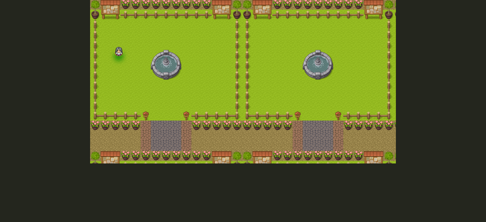

# Game - RPG
This project was inspired by RPG games and was developed to practice the following technologies: React and typescript. The design is not responsive to smaller screen sizes, so I encourage you to open the project on your desktop.

## Functionalities
* The user can move throughout the map but is prevented from moving forward when faced with an obstacle (e.g. fountain, fence, plants);
* There is a green shadow around the icon when it is inside the protected area;
* There is a red shadow around the icon when it is outside the protected area;
* A danger message appears on the screen when the icon is outside the protected area.

## Technologies used
* React
* Typescript
* Styled-components
* HTML

## Link to access the project
[www.game-rpg.com](https://combative-soap.surge.sh/)

## Installing
<pre>
  <code>$ git clone https://github.com/francinehahn/game-rpg.git</code>
</pre>

<pre>
  <code>$ cd game-rpg</code>
</pre>

<pre>
  <code>$ npm install</code>
</pre>

## Images
